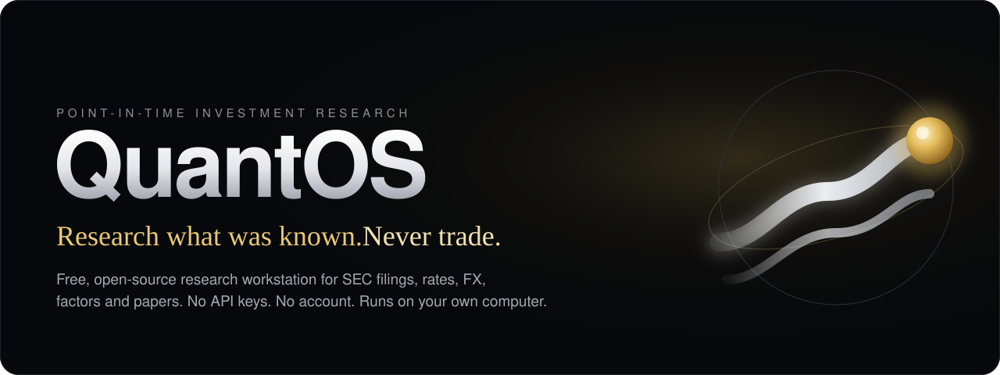
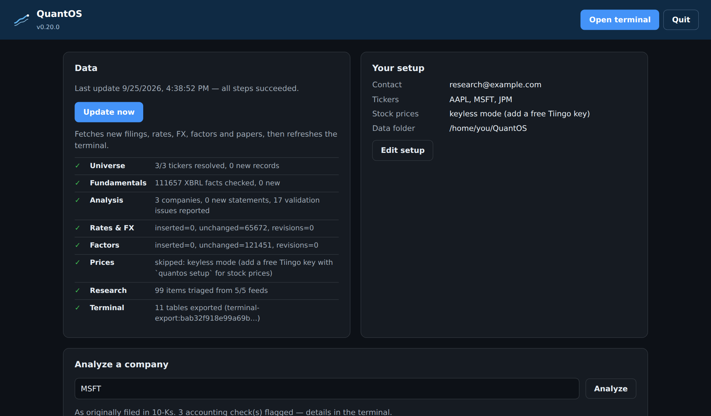
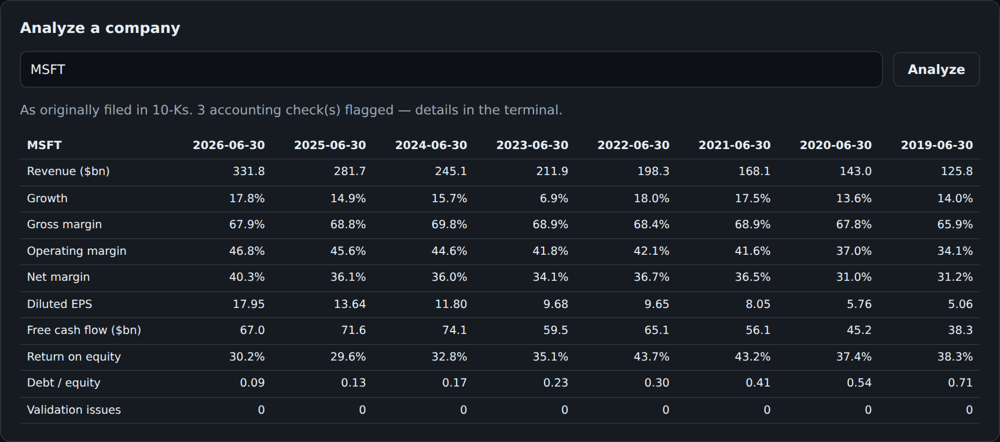
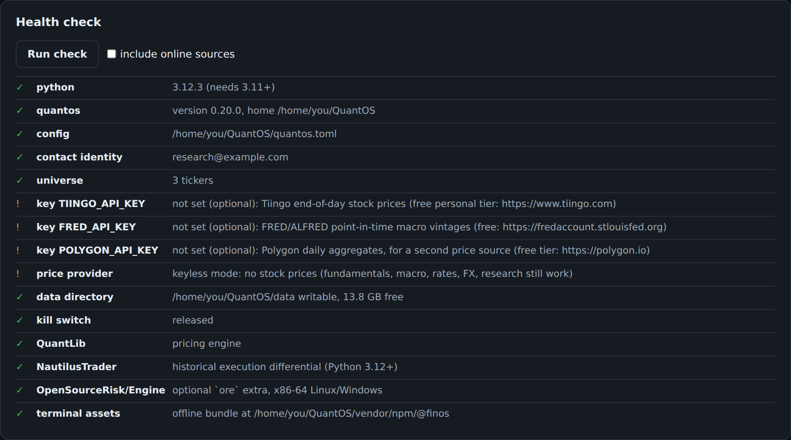
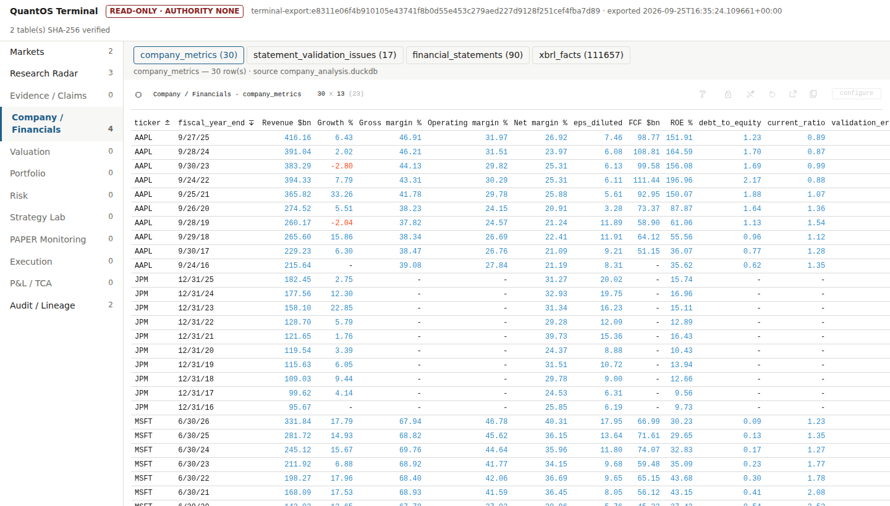
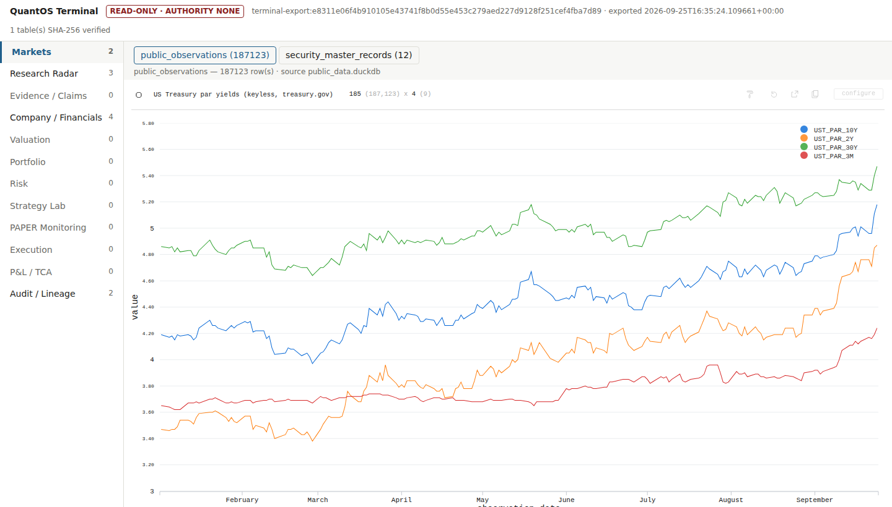
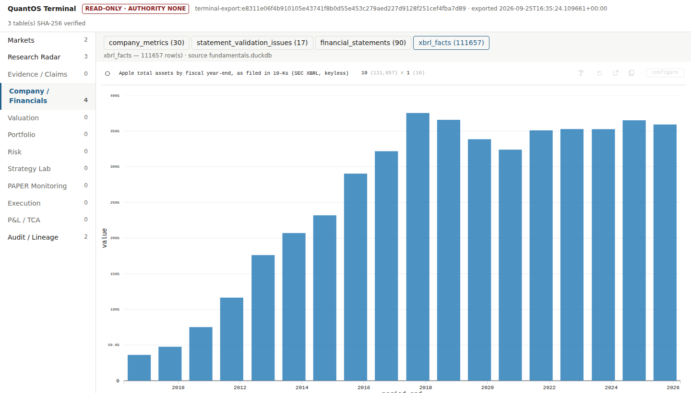
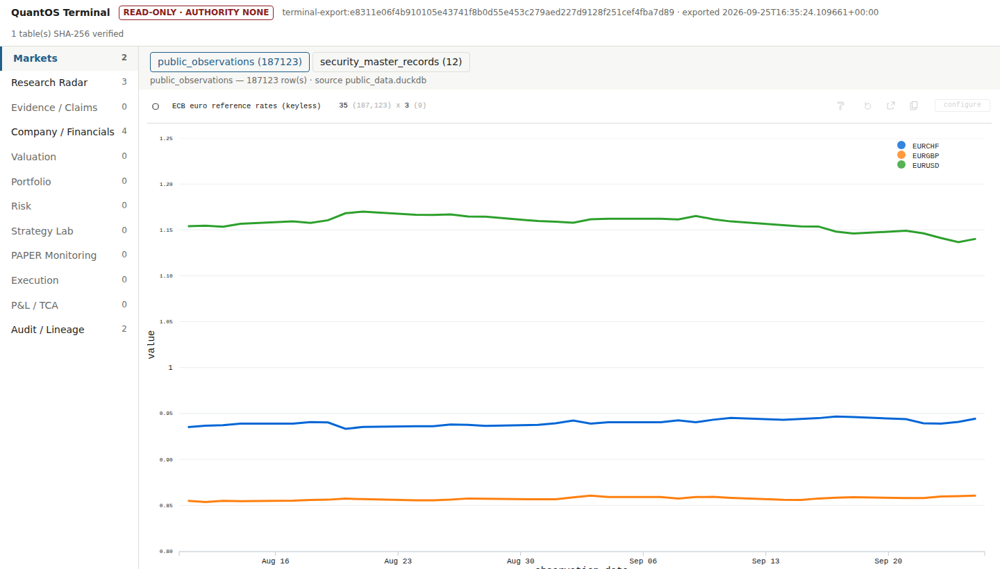
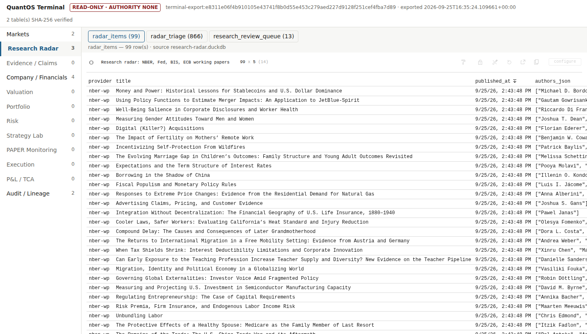
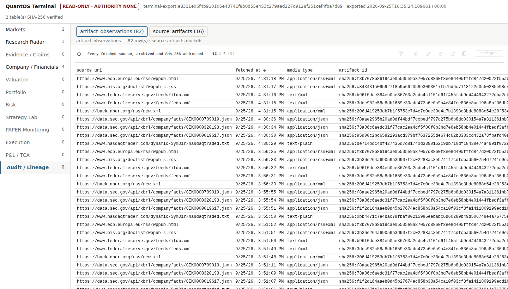

<p align="center">
  <a href="https://github.com/purysho/QuantOS/releases/latest"></a>
</p>

<p align="center">
  <a href="https://github.com/purysho/QuantOS/releases/latest/download/QuantOS-Windows-x64.zip"></a>
  <a href="https://github.com/purysho/QuantOS/releases/latest/download/QuantOS-macOS-arm64.dmg"></a>
  <a href="https://github.com/purysho/QuantOS/releases/latest/download/QuantOS-Linux-x86_64.AppImage"></a>
  <a href="https://github.com/purysho/QuantOS/releases/latest/download/quantos-live-usb-amd64.iso"></a>
</p>

<p align="center">
  <a href="LICENSE"></a>
  
  
  
</p>

<p align="center">
  <a href="#download"><b>Download</b></a> ·
  <a href="docs/USER_GUIDE.md"><b>User Guide</b></a> ·
  <a href="#features"><b>Features</b></a> ·
  <a href="#data-sources"><b>Data sources</b></a> ·
  <a href="docs/CAPABILITIES.md"><b>Capabilities</b></a> ·
  <a href="CHANGELOG.md"><b>Changelog</b></a>
</p>

# QuantOS

A free, open-source investment research workstation. It pulls official public data (SEC filings, US Treasury yields, ECB exchange rates, Federal Reserve data, Fama-French factors and new working papers) into one local, point-in-time database on your own computer. You then analyze it in a desktop app and a fast analytical terminal.

Every number records where it came from and when it became knowable, so research never quietly uses information from the future. There's no account, no subscription and no API key, and it can never place a trade.



## Features

- **A desktop app for everyone.** Download it for Windows, macOS or Linux and double-click. A control center opens in your browser, where you set it up, update your data with one button and analyze companies. Everything runs on your own computer.
- **Company analysis in one step.** Type a ticker to get ten years of standardized income statements, balance sheets and cash flows from SEC filings, as originally filed and checked against accounting identities, plus growth, margins, free cash flow, returns and leverage.
- **Point-in-time by construction.** Every fact carries *event time* and *knowledge time*. A restatement is stored as a new version, never an overwrite, so a backtest sees only what was known then.
- **Company fundamentals, keyless.** It stores every XBRL fact a company has filed with the SEC (tens of thousands per company), each tagged with its filing and the moment it became public.
- **Rates, FX, macro and factors.** The US Treasury par curve, ECB euro reference rates, key FRED series (yields, fed funds, CPI, unemployment, breakevens) and the Fama-French daily factors are fetched daily. Their history can be backfilled.
- **Research radar.** New working papers and releases from NBER, the Federal Reserve, BIS, ECB, SEC, SSRN and arXiv are triaged into a review queue. They are treated as leads, never as facts.
- **Analytical terminal.** A Perspective-powered, read-only workspace (Markets, Company, Portfolio, Risk, Execution, Audit and more) where you can pivot, filter and chart everything. It works fully offline.
- **Valuation and modeling.** Linked three-statement projections, then DCF, comparables, sum-of-the-parts and LBO, each allowed only for businesses it suits, with a triangulation that keeps disagreements visible.
- **Portfolio and risk.**
  - walk-forward validation with overfitting diagnostics;
  - constrained and hierarchical portfolios;
  - QuantLib pricing, and historical VaR/ES with backtests;
  - OpenSourceRisk/Engine cross-checks.
- **Execution research.** A deterministic fill simulator is checked against NautilusTrader under twelve frozen equivalence contracts. It adds a replay data-quality gate and implementation-shortfall TCA.
- **Evidence discipline.** Claims need verified sources, a reviewer who isn't the drafter, and counter-evidence. Blocking objections can't be outvoted.
- **Safe by design.** There's no broker connection and no order routing anywhere. Secrets stay in a private folder, outbound hosts are allow-listed, an operator kill switch stops all fetching, and every action lands in a hash-chained audit log.

| Company analysis | Health check | Company metrics in the terminal |
| --- | --- | --- |
|  |  |  |

| Treasury yield curve | Company fundamentals | Euro reference rates |
| --- | --- | --- |
|  |  |  |

| Research radar | Point-in-time filings | Source lineage |
| --- | --- | --- |
|  |  |  |

## Download

The buttons at the top always get the newest release; every file is also on the [Releases page](https://github.com/purysho/QuantOS/releases/latest). After installing, start with the **[User Guide](docs/USER_GUIDE.md)**.

- **Windows 10/11:** unzip `QuantOS-Windows-x64.zip`, open the `QuantOS` folder and double-click `QuantOS.exe`. It needs no installation or admin rights, and it runs from a USB stick too (create a `QuantOS-data` folder beside the exe to keep your data with it).
- **macOS 12+ (Apple Silicon):** open the `.dmg` and drag **QuantOS** to Applications.
- **Linux (x86-64):** `chmod +x QuantOS-Linux-x86_64.AppImage`, then run it.
- **Any PC, nothing installed:** write the live-USB ISO to a stick with encrypted persistence ([guide](packaging/live-usb/README.md)).
- **Docker/Podman:** `docker run --rm -it -v quantos:/quantos ghcr.io/purysho/quantos setup`, or use [`compose.yaml`](compose.yaml).

The app opens a control center in your browser. Everything runs on your own computer; nothing is hosted.

> The builds aren't code-signed yet, so Windows SmartScreen and macOS Gatekeeper warn the first time. On Windows choose **More info → Run anyway**. On macOS, right-click the app, choose **Open**, then **Open** again. On macOS 15, use **System Settings → Privacy & Security → Open Anyway**. Every file has a SHA-256 checksum and a build-provenance attestation you can verify ([how](docs/USER_GUIDE.md#verifying-a-download)).

## Everyday use

1. **Set up.** Enter a contact email (SEC and Crossref require one), the tickers you follow, and any optional free keys.
2. **Update.** This fetches new filings, rates, FX, factors and papers, then refreshes the terminal. It is safe to run as often as you like; unchanged data is never stored twice.
3. **Analyze.** Type a ticker to get ten years of standardized statements and metrics, as originally filed and checked against accounting identities.
4. **Open the terminal.** Pick a workspace, and use **configure** to pivot, filter and chart.

Everything in the app is also available on the command line: `quantos setup`, `quantos daily`, `quantos analyze AAPL`, `quantos terminal serve` and `quantos doctor --online`.

## Data sources

| Data | Source | Cost |
| --- | --- | --- |
| Company fundamentals and restatements (XBRL) | SEC EDGAR | free, no key |
| Ticker → company → exchange | SEC EDGAR | free, no key |
| Treasury par yield curve | treasury.gov | free, no key |
| Euro FX reference rates | ECB Data Portal | free, no key |
| Macro series (latest values) | FRED | free, no key |
| Fama-French factors (daily 5 factors + momentum) | Kenneth R. French Data Library | free, no key |
| Listing venue and ETF/ADR flags | Nasdaq Trader symbol directory | free, no key |
| Working papers and releases | NBER, Fed, BIS, ECB, SEC, SSRN, arXiv | free, no key |
| Daily stock prices | Tiingo or Polygon | free personal key |
| Macro series as known on past dates | ALFRED | free personal key |

Keys stay on your machine in a private folder, never in URLs or logs. Each provider's own terms of use apply.

## How it's built

- **Python 3.11–3.13**, with **DuckDB** stores. Every artifact is content-addressed with SHA-256, and dependencies are locked with **uv**.
- **External engines behind contracts:**
  - QuantLib for pricing;
  - NautilusTrader for historical execution;
  - OpenSourceRisk/Engine for risk.
  Each is checked against an independent QuantOS reference implementation, and disagreements are preserved.
- **FINOS Perspective** powers the terminal. The browser verifies every table's SHA-256 before showing it.
- **Packaging:** a Debian 13 live-build image (free software only by default) and a hardened container that is non-root with a read-only root filesystem.
- **Downloads** are built with PyInstaller on each OS's own runner. Each must pass its own self-test before a release is published, with checksums, an SBOM and provenance attestations.
- **Tests** run on Python 3.11, 3.12 and 3.13 in CI, and a license gate blocks any dependency with an unreviewed license.

A deeper tour is in [docs/CAPABILITIES.md](docs/CAPABILITIES.md). Stage-by-stage design notes are in [`docs/`](docs/), the engineering history is in [HANDOFF.md](HANDOFF.md), and the previous README is kept in [logs.md](logs.md).

## Development

```bash
uv sync --locked --extra ore                    # exact environment (ore: x86-64)
uv run python -m unittest discover -s tests     # full suite
uv run quantos demo && uv run quantos edge-demo # fail-closed demos
```

See [CONTRIBUTING.md](CONTRIBUTING.md) for the project's ground rules, and [SECURITY.md](SECURITY.md) to report a vulnerability.

## License

[Apache-2.0](LICENSE). See [NOTICE](NOTICE) and [THIRD_PARTY_NOTICES.md](THIRD_PARTY_NOTICES.md). QuantOS is research software; nothing it produces is investment advice.
