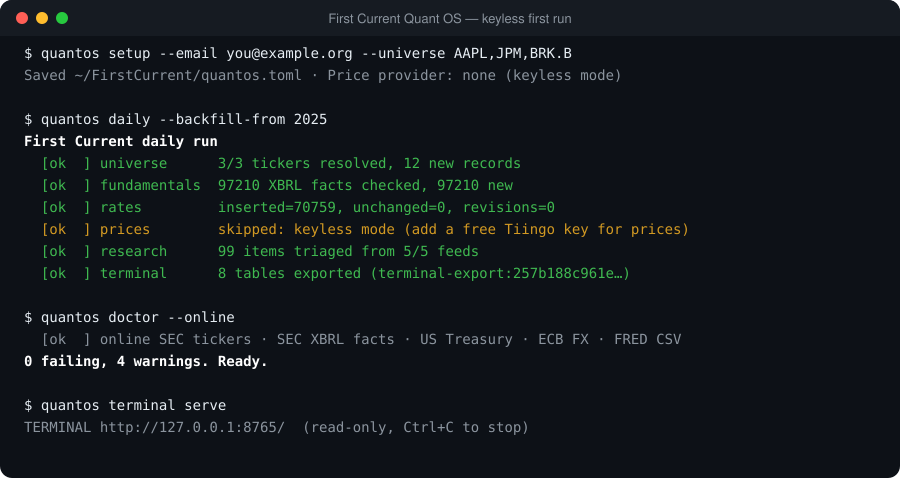

<p align="center">
  
</p>

<h1 align="center">First Current Quant OS</h1>

<p align="center">
  <b>A free, open-source investment research workstation that runs without API keys and can never trade.</b>
</p>

<p align="center">
  <a href="LICENSE"></a>
  
  
  
  
</p>

First Current pulls official public data into one local, point-in-time research database: SEC filings, US Treasury yields, ECB exchange rates, Federal Reserve data and new working papers. You explore it in a fast analytical terminal. Every number records where it came from and when it became knowable, so research never quietly uses information from the future. It runs from a bootable USB stick, a container or a plain Python install, with no account, no subscription and no API keys.


## Features

- **Point-in-time by construction.** Every fact carries *event time* and *knowledge time*. A restatement is stored as a new version, never an overwrite, so a backtest sees only what was known then.
- **Company fundamentals, keyless.** It stores every XBRL fact a company has filed with the SEC (tens of thousands per company), each tagged with its filing and the moment it became public.
- **Rates, FX and macro.** The US Treasury par curve, ECB euro reference rates and key FRED series (yields, fed funds, CPI, unemployment, breakevens) are fetched daily. Their history can be backfilled.
- **Research radar.** New working papers and releases from NBER, the Federal Reserve, BIS, ECB, SEC, SSRN and arXiv are triaged into a review queue. They are treated as leads, never as facts.
- **Analytical terminal.** A Perspective-powered, read-only workspace (Markets, Company, Portfolio, Risk, Execution, Audit and more) where you can pivot, filter and chart everything. It works fully offline.
- **Valuation and modeling.** Linked three-statement projections, then DCF, comparables, sum-of-the-parts and LBO, each allowed only for businesses it suits, with a triangulation that keeps disagreements visible.
- **Portfolio and risk.**
  - walk-forward validation with overfitting diagnostics;
  - constrained and hierarchical portfolios;
  - QuantLib pricing, and historical VaR/ES with backtests;
  - OpenSourceRisk/Engine cross-checks.
- **Execution research.** A deterministic fill simulator is checked against NautilusTrader under twelve frozen equivalence contracts. It adds a replay data-quality gate and implementation-shortfall TCA.
- **Evidence discipline.** Claims need verified sources, a reviewer who isn't the drafter, and counter-evidence. Blocking objections can't be outvoted.
- **Safe by design.** There's no broker connection and no order routing anywhere. Secrets stay in a private folder, outbound hosts are allow-listed, an operator kill switch stops all fetching, and every action lands in a hash-chained audit log.

| Company fundamentals | Euro reference rates | Research radar |
| --- | --- | --- |
|  |  |  |

| Point-in-time filings | Source lineage | First run |
| --- | --- | --- |
|  |  |  |

## Get started

<p>
  <a href="packaging/live-usb/README.md"></a>
  <a href="docs/USER_GUIDE.md#container-linux-macos-windows"></a>
  <a href="docs/USER_GUIDE.md#python-developers"></a>
</p>

- **Live USB.** Boot any 64-bit PC from a USB stick. Your work is saved on an encrypted partition, and a setup window guides you on first login. [Build or write the stick →](packaging/live-usb/README.md)
- **Container.** On Windows, macOS or Linux with Docker:
  ```bash
  docker compose run --rm quantos setup     # contact email, tickers, optional free keys
  docker compose run --rm quantos daily     # fetch data and refresh the terminal
  docker compose up -d terminal             # open http://127.0.0.1:8765/
  ```
- **Python.** On Linux with [uv](https://docs.astral.sh/uv/): `uv sync --locked`, then `uv run quantos setup`.

New here? The **[User Guide](docs/USER_GUIDE.md)** walks through everything after installing.

## Everyday use

1. **`quantos setup`.** Enter a contact email (SEC and Crossref require one), the tickers you follow, and any optional free keys.
2. **`quantos daily`.** This fetches new filings, rates, FX, macro data and papers, then refreshes the terminal. It is safe to run as often as you like; unchanged data is never stored twice. The USB edition runs it automatically on weekdays.
3. **`quantos terminal serve`.** Open `http://127.0.0.1:8765/`, pick a workspace, and use **configure** to pivot, filter and chart.
4. **`quantos doctor --online`.** If something looks wrong, this explains in plain words what works and what to fix.

## Data sources

| Data | Source | Cost |
| --- | --- | --- |
| Company fundamentals and restatements (XBRL) | SEC EDGAR | free, no key |
| Ticker → company → exchange | SEC EDGAR | free, no key |
| Treasury par yield curve | treasury.gov | free, no key |
| Euro FX reference rates | ECB Data Portal | free, no key |
| Macro series (latest values) | FRED | free, no key |
| Working papers and releases | NBER, Fed, BIS, ECB, SEC, SSRN, arXiv | free, no key |
| Daily stock prices | Tiingo or Polygon | free personal key |
| Macro series as known on past dates | ALFRED | free personal key |

Keys stay on your machine in a private folder, never in URLs or logs. Each provider's own terms of use apply.

## How it's built

- **Python 3.11–3.13**, with **DuckDB** stores. Every artifact is content-addressed with SHA-256, and dependencies are locked with **uv**.
- **External engines behind contracts:**
  - QuantLib for pricing;
  - NautilusTrader for historical execution;
  - OpenSourceRisk/Engine for risk.
  Each is checked against an independent First Current reference implementation, and disagreements are preserved.
- **FINOS Perspective** powers the terminal. The browser verifies every table's SHA-256 before showing it.
- **Packaging:** a Debian 13 live-build image (free software only by default) and a hardened container that is non-root with a read-only root filesystem.
- **741 tests** run on Python 3.11, 3.12 and 3.13 in CI, and a license gate blocks any dependency with an unreviewed license.

A deeper tour is in [docs/CAPABILITIES.md](docs/CAPABILITIES.md). Stage-by-stage design notes are in [`docs/`](docs/), the engineering history is in [HANDOFF.md](HANDOFF.md), and the previous README is kept in [logs.md](logs.md).

## Development

```bash
uv sync --locked --extra ore                    # exact environment (ore: x86-64)
uv run python -m unittest discover -s tests     # full suite
uv run quantos demo && uv run quantos edge-demo # fail-closed demos
```

See [CONTRIBUTING.md](CONTRIBUTING.md) for the project's ground rules, and [SECURITY.md](SECURITY.md) to report a vulnerability.

## License

[Apache-2.0](LICENSE). See [NOTICE](NOTICE) and [THIRD_PARTY_NOTICES.md](THIRD_PARTY_NOTICES.md). First Current is research software; nothing it produces is investment advice.
