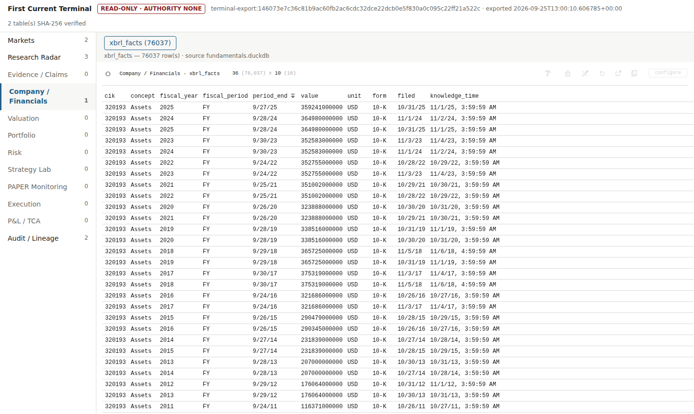

# First Current Quant OS

**A free, open-source investment research operating system that can never trade.**

First Current is a point-in-time research OS for fundamentals, valuation, portfolio, risk and execution research. Every number it shows can be traced to its source and to the moment it became knowable. It runs with **no API keys at all**, from a bootable USB stick, a container, or a plain Python install. It is licensed under Apache-2.0.



<sub>Apple's reported total assets from SEC EDGAR, fetched without a key. Each row carries the filing it came from and the moment it became knowable. The FY2015 value was restated a year later, and both versions are kept.</sub>

---

## Why it is different

- **Point in time, always.** Every fact carries *event time* and *knowledge time*. A backtest can use only what was known then; a restatement is a new version, never an overwrite.
- **Fail closed.** Missing, ambiguous or inconsistent data is reported, never guessed or filled.
- **Independently verified engines.** QuantLib, NautilusTrader and OpenSourceRisk/Engine each sit behind a First Current contract and are checked against an independent reference implementation. Disagreements are preserved.
- **No capital path.** No broker connection, no order routing and no credentials for either exist in the code. Every artifact's authority is `NONE`.
- **Free.** Official public sources work without signup. Optional free personal keys add stock prices and macro vintages.

## Get started

Pick one of three ways to run it:

| | Best for | Start |
|---|---|---|
| **Live USB** | Anyone. Boot any x86-64 PC; data persists on an encrypted partition | [`packaging/live-usb/`](packaging/live-usb/README.md) |
| **Container** | Linux, macOS or Windows with Docker/Podman | `docker compose run --rm quantos setup` |
| **Python** | Developers on Linux (Python 3.11+) | `uv sync --locked`, then `uv run quantos setup` |

Then:

```bash
quantos setup            # contact email (SEC/Crossref require one), tickers, optional free keys
quantos doctor --online  # checks what works on this machine
quantos daily            # fetch fundamentals, rates, FX, macro, research; refresh the terminal
quantos terminal serve   # http://127.0.0.1:8765/  (read-only)
```

The full walkthrough is in the [user guide](docs/USER_GUIDE.md).

## Data sources

| Data | Source | Key |
|---|---|---|
| Point-in-time company fundamentals (XBRL facts, restatements) | SEC EDGAR | none (contact email only) |
| Ticker → company → exchange (seeds the Security Master) | SEC EDGAR | none |
| US Treasury par yield curve | treasury.gov | none |
| Euro FX reference rates | ECB Data Portal | none |
| Macro series, latest values | FRED graph CSV | none |
| Working papers, speeches and regulatory releases | arXiv, Crossref/SSRN, NBER, Fed, SEC, BIS, ECB | none |
| Daily stock prices | Tiingo (or Polygon) | free personal key |
| Macro series as known on past dates (vintages) | ALFRED | free personal key |

Keys stay on your machine in a private `secrets/` folder and are never put in URLs or logs. Each provider's own terms of use still apply.

## What's inside

- **Evidence and research intake:** a research radar with triage and review queues, claim cards with drafter/reviewer separation, an evidence graph, and professional review roles whose blocking objections cannot be outvoted.
- **Fundamentals and valuation:** point-in-time statements, linked projections, debt/NOL/equity schedules, and methodology-gated DCF, comparables, SOTP and LBO with triangulation.
- **Quant research, portfolio and risk:**
  - walk-forward validation with overfitting diagnostics;
  - constrained and hierarchical portfolio construction;
  - QuantLib pricing, and historical VaR/ES with backtesting;
  - ORE differentials for swaps, bonds, options, sensitivities and stress.
- **Execution research:** a deterministic reference fill engine, twelve frozen NautilusTrader equivalence contracts, a replay data-quality gate, implementation-shortfall TCA, and two-person execution review.
- **Operations:** an exchange calendar, the Security Master and corporate actions, the market-data pipeline, tracing and metrics, the egress allowlist, a kill switch, a hash-chained audit log, and a read-only, integrity-verified Perspective terminal.

The engine-by-engine inventory is in [docs/CAPABILITIES.md](docs/CAPABILITIES.md). Stage documents live in [`docs/`](docs/), and the build history and roadmap are in [HANDOFF.md](HANDOFF.md).

## What the labels mean

- `VERIFIED` source means the source's identity was checked, not that its conclusions are proven.
- `APPROVED` claim means a scoped claim passed review, not that it is universally true.
- `ESTIMATED` line means model output, not a filed fact.
- `REFERENCE_MATCH_ONLY` means an engine reproduced a frozen historical fixture, not that live execution is validated.
- `NO_TRADE`, `UNKNOWN`, `INCOMPLETE` and `INSUFFICIENT_EVIDENCE` are valid outcomes.

Nothing First Current produces is investment advice.

## Development

```bash
uv sync --locked --extra ore           # exact, hash-verified environment (ore: x86-64 only)
uv run python -m unittest discover -s tests
uv run quantos demo && uv run quantos edge-demo
```

CI runs the full suite on Python 3.11, 3.12 and 3.13. Contribution rules are in [CONTRIBUTING.md](CONTRIBUTING.md), and vulnerability reporting is in [SECURITY.md](SECURITY.md). Dependencies are locked in `uv.lock` and `requirements.lock`, and a license gate blocks unreviewed dependency licenses.

## License

[Apache License 2.0](LICENSE). See [NOTICE](NOTICE) and [THIRD_PARTY_NOTICES.md](THIRD_PARTY_NOTICES.md). The licensing policy, including obligations for redistributed images, is in [docs/LICENSING.md](docs/LICENSING.md).
